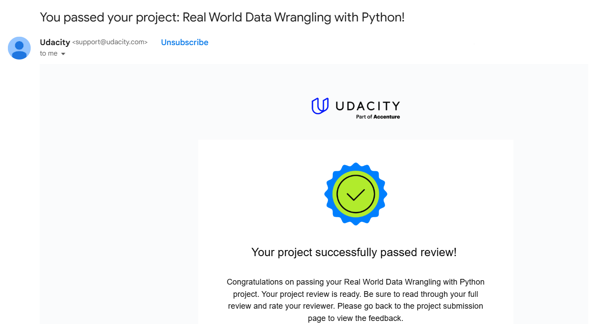

# Real World Data Wrangling with Python

This project, **"Real World Data Wrangling"**, focuses on analyzing two datasets to investigate various factors influencing box office performance. The datasets, sourced from Kaggle, include:

Attributes DataFrame: Provides metadata for 3,400 movies released between 2000 and 2020, such as movie titles, genres, and release years.

Daily Earnings Data for 3,400 Movies (2000-2020): Contains time-series data capturing daily earnings for these movies over the specified period.

The project aims to gather, assess, clean, and merge these datasets to address tidiness and quality issues. Once cleaned, the data is used to answer specific research questions, such as identifying trends in box office performance or evaluating the impact of genres on revenue.

The datasets can be accessed [here](https://www.kaggle.com/datasets/lukelarue/movie-attributes-for-3400-movies-from-20002020/data?select=Attributes_DataFrame.csv).

## Project Overview

### Key Steps:

**Data Gathering:**
- Attributes_DataFrame.csv: Contains movie-level details (e.g., budget, genres, MPAA rating).

- Daily_DataFrame.csv: Contains daily earnings and theater statistics for movies.

**Data Assessment:**
Identified quality and tidiness issues, such as missing values and structural inconsistencies.

**Data Cleaning:**
- Filled missing values (e.g., Budget and Theaters).

- Resolved outliers in earnings.

- Handled redundancy in genres (e.g., splitting genres into multiple rows).

**Data Merging:**
Combined the datasets using the movie title (Title) as the key.

**Data Analysis:**
- Explored factors affecting daily earnings, including budget and genres.

- Visualized the relationships between variables to answer the research questions.

----
### Libraries Used

The project relies on the following Python libraries:
- `pandas`
- `numpy`
- `matplotlib` (for visualizations)
- `requests`
- `seaborn`
- `os`
---

### Closing Statement
This project, **"Real World Data Wrangling with Python"**, was completed as part of the ***Data Analyst Nanodegree*** Program offered by **Udacity** in collaboration with **Google**. I successfully completed this project, demonstrating my ability to gather, assess, and clean real-world datasets to deliver actionable insights.

Additionally, I received official recognition for completing the program, as evidenced by the certification email:

